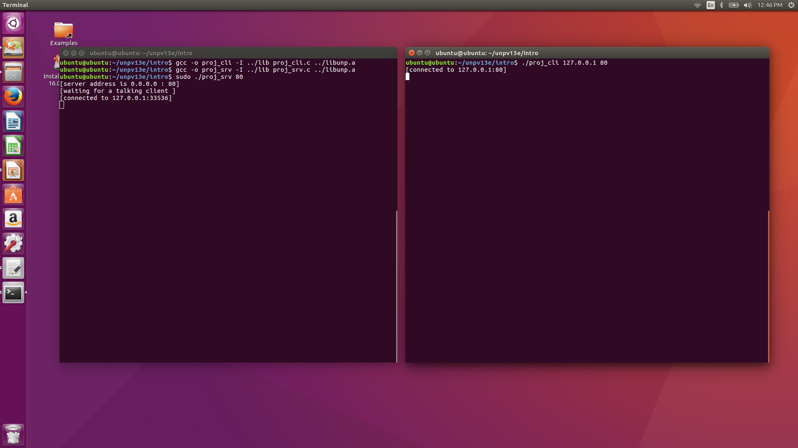
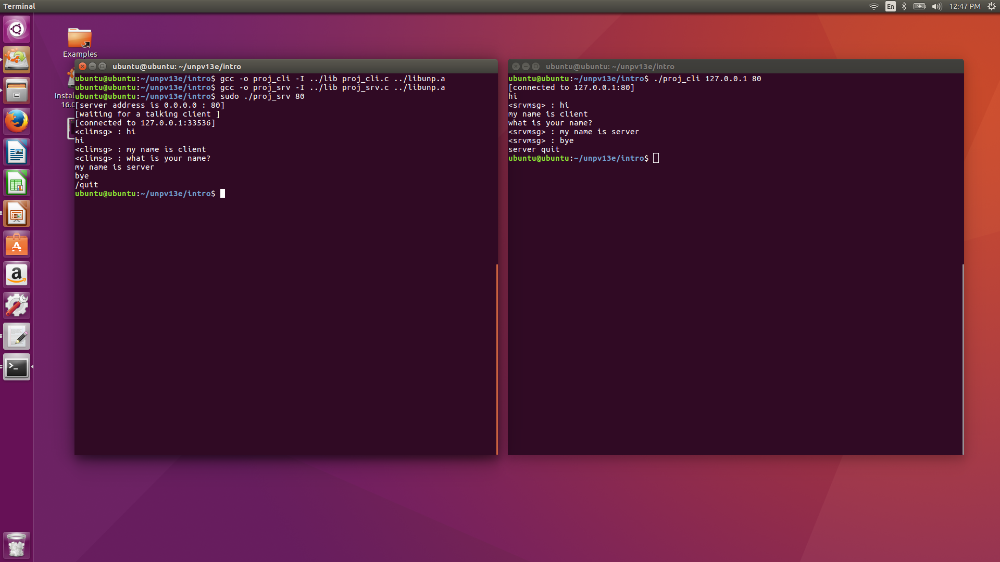

# NetworkProgramming

 

**왼쪽 터미널** : 서버  
**오른쪽 터미널** : 클라이언트  
**현재 서버와 클라이언트가 연결된 상태이다**

 

   </img>

 

**클라이언트와 서버가 서로 채팅을 하다가 /quit를 입력하면 대화가 종료되는 모습**

 

   </img>

 

**다시 클라이언트가 서버와 연결되면 통신을 하는 모습**

 

   </img>

